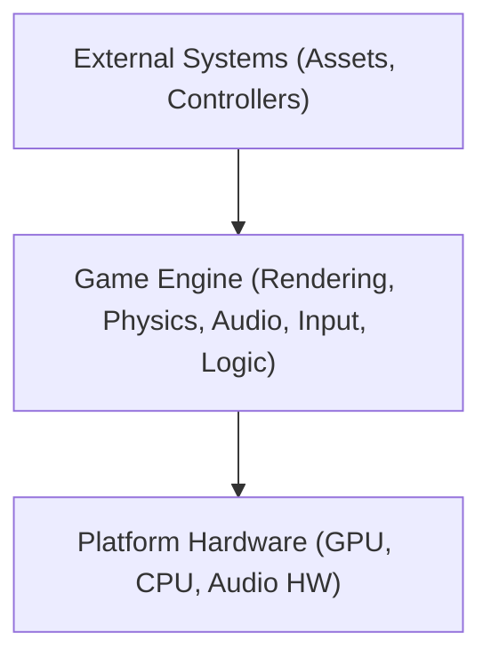
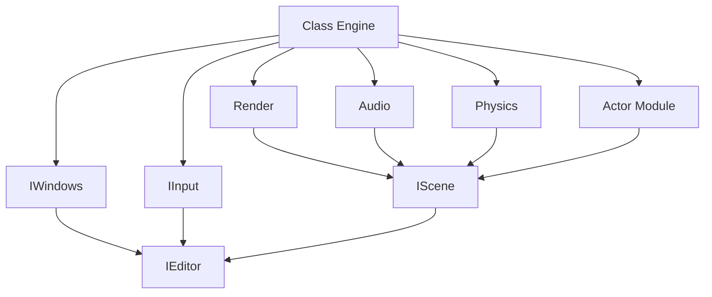
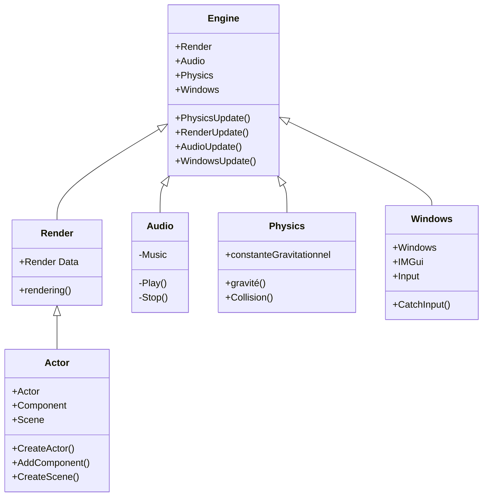

# Technical Design Document (TDD) for C++ Game Engine

## Document Header
- **Project Title:** C++ Game Engine Project
- **Version:** 1.0
- **Date:** 04-02-2026
- **Authors:** [MOREAU Adrien],[GONÇALVES Téo],[DOUBLET Théo],[POMMEZ Kiliann] et [HANSON Liam]

## Revision History
| Date       | Version | Description                | Author      |
|------------|---------|----------------------------|-------------|
| 04-02-2026 | 0.1     | Initial document creation  | Kiliann POMMEZ |
| 09-02-2026 | 0.2     | Architecture update        | Kiliann POMMEZ |

## Table of Contents
1. [Introduction](#1-introduction)
2. [System Overview](#2-system-overview)
3. [Requirements](#3-requirements)
4. [System Architecture & Design](#4-system-architecture--design)
5. [Interface Design](#5-interface-design)
6. [Performance and Optimization](#6-performance-and-optimization)
7. [Tools, Environment, and Deployment](#7-tools-environment-and-deployment)
8. [Project Timeline and Milestones](#8-project-timeline-and-milestones)
9. [Appendices](#9-appendices)

---

## 1. Introduction

### 1.1 Purpose
Ce document décrit la conception technique d'un moteur de jeu modulaire en C++, détaillant son architecture, ses modules

### 1.2 Scope
- **Objective:** Développer un moteur de jeu multiplateforme pour le rendu, la physique, l'audio et la gestion des entrées.
- **Application:** Développement de jeux en temps réel et projets académiques.
- **Contexte:** Ceci est un projet d'étudiant de 2 ème année de programation en équipe de 5 et sur une durée de 4 semaines
   
### 1.3 Definitions, Acronyms, and Abbreviations
- **API:** Application Programming Interface (Interface de programmation d'application)
- **FPS:** Frames Per Second (Images par seconde)
- **IDE:** Integrated Development Environment (Environnement de développement intégré)

### 1.4 References
- [C++ Standard Documentation](https://isocpp.org)
- [Google Test Framework](https://github.com/google/googletest)

### 1.5 Document Overview
Ce document détaille la conception, les interactions entre modules et les stratégies de test pour le moteur de jeu, assurant la clarté depuis l'architecture de haut niveau jusqu'aux détails d'implémentation de bas niveau.

---

## 2. System Overview

### 2.1 High-Level Description
Le moteur est un système modulaire écrit en C++ (C++17 ou ultérieur), conçu pour gérer le rendu, la simulation physique, le traitement audio et la gestion des entrées en temps réel.

### 2.2 System Context Diagram

### 2.3 Major Components
- **Rendering Engine:** Gère les graphismes en utilisant une API DirectX11.
- **Physics Engine:** Gère la détection de collision et les simulations physiques.
- **Audio Engine:** Traite les effets sonores et la musique.
- **Input Manager:** Capture les événements clavier, souris.
- **Game Logic:** Intègre les modules via une interface de scripting.

---

## 3. Requirements

### 3.1 Functional Requirements
- Rendre des graphismes 2D/3D avec éclairage dynamique et ombrage (shading).
- Effectuer une simulation physique et une détection de collision en temps réel.
- Jouer de la musique de fond et déclencher des effets sonores.
- Capturer et traiter les entrées utilisateur.
- Fournir une interface de scripting pour la personnalisation du comportement du jeu.

### 3.2 Non-Functional Requirements
- **Performance:** Maintenir un minimum de 60 FPS.
- **Scalability:** Conception modulaire pour une extension facile.
- **Maintainability:** Structure de code claire avec une documentation exhaustive.

### 3.3 Use Cases
- **Rendering:** Charger et afficher des scènes complexes.
- **Physics:** Mettre à jour l'état des objets et détecter les collisions.
- **Audio:** Gérer et jouer les assets audio.
- **Input:** Mappers les actions utilisateur aux événements du jeu.

### 3.4 Design Constraints and Assumptions
- Utiliser le C++ moderne (C++17 ou ultérieur).
- S'appuyer sur l'accélération matérielle graphique.

---

## 4. System Architecture & Design

### 4.1 Architectural Overview
Le moteur utilise une architecture basée sur les composants. Chaque module possède des interfaces bien définies, assurant un couplage faible et un développement isolé.

### 4.2 Module Breakdown
- **Engine Module:** sert à diriger le fonctionnement du moteur
- **Rendering Module:** Gère les shaders, les textures et communique avec le GPU.
- **Physics Module:** Implémente la détection de collision et la dynamique des corps rigides.
- **Audio Module:** Focntionnement de la bibliothèques audio.
- **Input Module:** Gère les entrées spécifiques aux périphériques.
- **Actor Module:**  Gère les actor avec les diférents components qu'il peuvent avoir
- **Editor Module:** gère les interface avec IMGui pour qu'on puisse intéragir avec la scene
- **Window Module:** Permet d'avoir une fenetre avec toute nos modules a l'intérieur
- **Scene Module:** Monde simuler en 3D qui est le monde de notre jeu

### 4.3 Interaction Diagrams

#### Architecture

Class Diagramme

### 4.4 Design Decisions and Rationale
- **Language Choice:** C++ pour la haute performance.
- **Modular Design:** Supporte les tests isolés et le développement indépendant des modules.
- **APIGraphique:** DirectX11
- **APIPhysics:** Jolt
- **APIAUdio:** Mini Audio

### 4.5 Why DX11
Nous n'avons pas choisis DX12 et Vulkan pour plusieurs raisons :
 - **Pipeline State Objects (PSO):** DX11 permet de changer des états (BlendState, DepthStencilState) de manière granulaire. DX12 force la création de PSOs complets en amont, ce qui complexifie énormément l'architecture du système de matériaux (Material System) et constitue un travail considérable.
 - **Synchronisation et Race Conditions:** DX11 utilise un contexte immédiat qui gère la synchronisation pour vous. DX12/Vulkan imposent une gestion manuelle des files d'attente (queues) et des barrières de transition. Une erreur de synchronisation sous DX12 peut provoquer des crashs GPU aléatoires très difficiles à débugger.

Et nous n'avons pas choisis OpenGL pour ces raison :
- **État de la Machine (State Machine):** OpenGL est une machine à états globale héritée des années 90, ce qui rend le code difficile à encapsuler proprement en C++ (effets de bord fréquents). DX11, bien qu'utilisant un contexte, est beaucoup plus orienté objet et se prête mieux à une architecture avec RAII et Smart Pointers.
- **Drivers et Consistance:** Les drivers OpenGL (surtout chez AMD et Intel) sont notoirement inconsistants. Un shader qui fonctionne sur NVIDIA peut échouer sur AMD. DX11 est extrêmement stable et prévisible sur Windows.

### 4.6 Why Mini Audio
FMOD et Mini Audio sont les API les plus intéressante pour un projet de moteur 3D étudiant
mais Mini Audio serait plus intéressant pour nous.
Pourquoi ?
- Mini Audio se démarque de FMOD sur la facilité d’intégration, pour ce dont on à besoin c’est largement suffisant pour notre moteur. Et pas besoin de Tools sound design.
- Avec FMOD on doit gérer l'éditeur Audio alors qu’on en à pas besoin avec Mini Audio, plus compliquer à synchroniser avec notre code et possibilité d’overKill trop puissant pour un simple moteur étudiant.
- OpenAL est une ancienne API très utilisée mais qui maintenant n’est plus la référence de la modernité, une philosophie comme OpenGL or on utilise pas OpenGL donc pas utile.

### 4.7 Why Jolt
Nous avons choisis Jolt Physics pour ces raisons :
- **Modernité du C++:** Jolt utilise du C++17 natif. Bien qu'il utilise son propre système de comptage de références (RefTarget / Ref<T>) pour des raisons de performance et de thread-safety (évitant l'overhead de std::shared_ptr), il respecte strictement les principes RAII.
- **Mémoire et Cache:** L'API est pensée pour être "cache-friendly". Les structures de données sont compactes, ce qui réduit les cache misses, un goulot d'étranglement classique sur les moteurs plus anciens comme Bullet.
- **Déterminisme:** Jolt garantit un déterminisme total sur une même plateforme/compilateur
On as écraté NVIDIA PhysX pour ces raisons :
- **Obésité logicielle (Bloat):** PhysX est une "boîte noire" massive. Intégrer PhysX, c'est importer des décennies de code legacy, de simulations de fluides et de tissus dont on auras probablement pas besoin.
- **Complexité d'API:** L'API PhysX est verbeuse et utilise des patterns de "Cooking" (pré-calcul des collisions) qui peuvent alourdir notre workflow de développement d'assets.
On as aussi écarté Bullet Physics pour ces raisons :
-**Stabilité des contraintes:** Dans des scènes complexes (piles d'objets, ragdolls articulés), les solveurs de Bullet ont tendance à être moins stables ("jittering") que ceux de Jolt ou PhysX sans un réglage manuel fastidieux.
-**Maintenance:** Le développement de Bullet 3 s'est ralenti au profit de PyBullet (robotique). Pour un moteur de jeu performant en 2026, Bullet est considéré comme un choix "legacy".

---

## 5. Interface Design

### 5.1 Internal Interfaces

- Définir des APIs claires entre les modules en utilisant des classes abstraites ou des interfaces.

### 5.2 External APIs and File Formats

- Supporter les formats de fichiers standards : OBJ (modèles), PNG (textures), WAV (audio).
- Fournir une documentation pour les interfaces de scripting externes.

---

## 6. Performance and Optimization

### 6.1 Performance Goals

- Atteindre constamment 60 FPS.
- Optimiser l'utilisation de la mémoire et la surcharge de traitement (overhead).

### 6.2 Profiling and Benchmarking

- Intégrer des outils de profilage tels que Valgrind ou Visual Studio Profiler.

### 6.3 Optimization Techniques

- Use object pooling and memory management best practices.
- Implement batching and frustum culling in the rendering process.

---

## 7. Tools, Environment, and Deployment

### 7.1 Development Tools and IDEs

- Recommended IDEs: Visual Studio
- Éditeurs de code supportant les fonctionnalités C++17.

### 7.2 Build System and Automation

- Utiliser CMake pour la configuration du projet.
- Automatiser les builds en utilisant des pipelines CI/CD.

### 7.3 Version Control

- Utiliser Git pour le contrôle de version.
- Adopter une stratégie de branches claire pour le développement des fonctionnalités.

### 7.4 Deployment Environment

- Target platforms: Windows.
- Fournir des instructions de déploiement et des guides de configuration de l'environnement.

---

## 8. Project Timeline and Milestones

- **Phase 1:** Analyse des prérequis & Conception détaillée
- **Phase 2:** Développement des modules
- **Phase 4:** Optimisation et Déploiement final

---

## 9. Appendices

### 9.1 Glossary

- **Game Engine:** Le cadre central gérant tous les processus du jeu.
- **Module:** Un composant autonome fournissant une fonctionnalité spécifique.
- **Shader:** Un programme exécuté sur le GPU pour contrôler le rendu.

